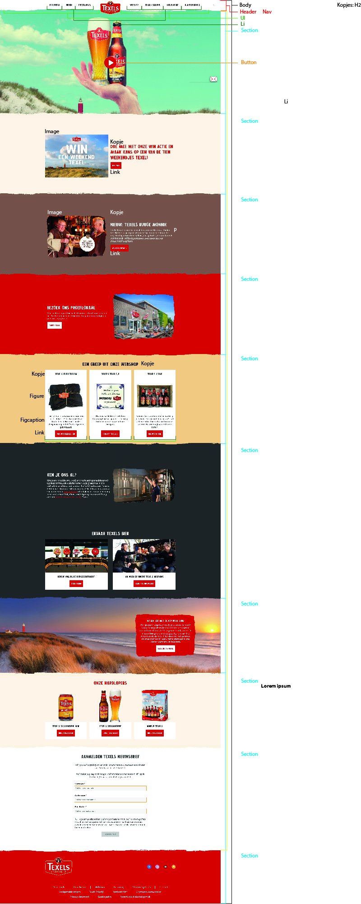
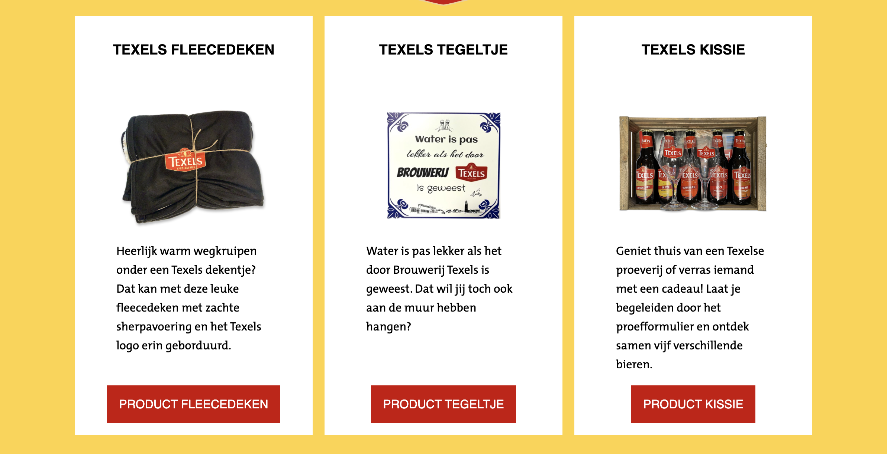
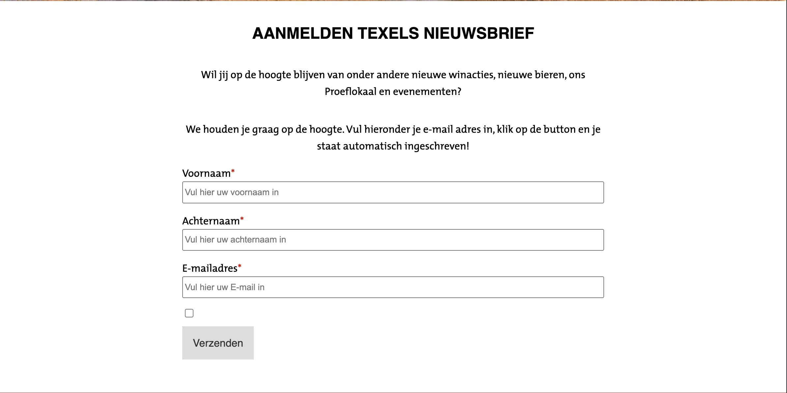

# Procesverslag
Markdown is een simpele manier om HTML te schrijven.  
Markdown cheat cheet: [Hulp bij het schrijven van Markdown](https://github.com/adam-p/markdown-here/wiki/Markdown-Cheatsheet).

Nb. De standaardstructuur en de spartaanse opmaak van de README.md zijn helemaal prima. Het gaat om de inhoud van je procesverslag. Besteedt de tijd voor pracht en praal aan je website.

Nb. Door *open* toe te voegen aan een *details* element kun je deze standaard open zetten. Fijn om dat steeds voor de relevante stuk(ken) te doen.

## Jij

  
uitwerken voor kick-off werkgroep

  ### Auteur:
  Lars van Veldhuizen

  #### Je startniveau:
  Rood

  #### Je focus:
  Responsive
 

## Je website

  
uitwerken voor kick-off werkgroep

  ### Je opdracht:
  https://www.texels.nl/

  #### Screenshot(s) van de eerste pagina (small screen): 
  https://www.texels.nl/  
  

  #### Screenshot(s) van de tweede pagina (small screen):
  https://www.texels.nl/bieren  
  
 

## Toegankelijkheidstest 1/2 (week 1)

  
uitwerken na test in 1e werkgroep

  ### Bevindingen
  Lijst met je bevindingen die in de test naar voren kwamen:

  -	De site is redelijk simpel gehouden waardoor het voor iemand met concentratieproblemen goed te doen is.

  #### Screenreader
  -	Screen reader is goed maar skipt alle afbeeldingen
  -	Een var aan de afbeelding toevoegen

  Hier een omschrijving van hoe het opgelost kan worden (met indien nodig afbeeldingen)

  #### Muis en Toetsenbord 
  Hier korte omschrijving (met indien nodig afbeeldingen)

  Hier een omschrijving van hoe het opgelost kan worden (met indien nodig afbeeldingen)

  #### Motoriek (shocks, elastiekjes)
  -	Er is weinig content ten opzichte van ruimte daardoor staat alles heel erg uit elkaar. Voor iemand met Parkinson duurt het dan erg lang voordat hij door de site heen is.

  Hier een omschrijving van hoe het opgelost kan worden (met indien nodig afbeeldingen)

  #### Visueel (brillen, contrast, kleurenblind, dark/light). 
  -	Leesbaarheid is goed op de links na, contrast slecht bij links.
  -	Sommige plaatjes kunnen misschien wat groter/duidelijker.
  -	Tekst in invulvelden en invulvelden is laag en niet leesbaarheid genoeg.
  -	NL in de header niet leesbaar en te dicht op de andere links
  -	Onze hardlopers, is het contrast van de vlakken met de achtergrond te laag
  -	Disabled button 
  -	De hover van buttons is af en toe niet goed zichtbaar

  -	disabled button niet goed zichtbaar 
  -	Protanopia: Links niet goed zichtbaar ten opzichte van de achterkant  
  -	Achromatopsia: Buttons niet herkenbaar en links ook niet en taal instellen

  Hier een omschrijving van hoe het opgelost kan worden (met indien nodig afbeeldingen)

## Breakdownschets (week 1)

  
uitwerken na afloop 2e werkgroep

  ### de hele pagina: 
  

  ### dynamisch deel (bijv menu): 
  

  ### wellicht nog een dynamisch deel (bijv filter): 
  

## Voortgang 1 (week 2)

  
uitwerken voor 1e voortgang

  ### Stand van zaken
  Ik had nog niet echt last van moeilijkheden qua coderen, de html had ik goed gestructureerd.
  Wel had ik nog wat problemen met het linken van mijn achtergrondafbeeldingen. Ook vind ik het nog
  lastig om mijn css goed te structureren.

  ### Agenda voor meeting
  samen met je groepje opstellen

  | student 1      | student 2          | student 3    | student 4        |
  | ---            | ---                | ---          | ---              |
  | dit bespreken  | en dit             | en ik dit    | en dan ik dat    |
  | en dat ook nog | dit als er tijd is | nog een punt | dit wil ik zeker |
  | ...            | ...                | ...          | ...              |

- Hoe kan ik het beste mijn css structureren?
- background-image werkt niet, waar ligt dat aan?
- Is het gebruikelijk om af te wisselen in display grid en flex?

  ### Verslag van meeting
  hier na afloop snel de uitkomsten van de meeting vastleggen
  - Je kan gebruik maken van een hulplijst van Sanne

## Voortgang 2 (week 3)

  
uitwerken voor 2e voortgang

  ### Stand van zaken
  De menu was wat lastiger om te maken maar met een beetje ondersteuning van Sanne ging het
  uiteindelijk wel. Ook ben ik begonnen met de productensectie maar de buttons bleven uitsteken.
  

  ### Agenda voor meeting
  samen met je groepje opstellen

  | student 1      | student 2          | student 3    | student 4        |
  | ---            | ---                | ---          | ---              |
  | dit bespreken  | en dit             | en ik dit    | en dan ik dat    |
  | en dat ook nog | dit als er tijd is | nog een punt | dit wil ik zeker |
  | ...            | ...                | ...          | ...              |

  - Hoe kan ik het beste mijn links uitlijnen ten opzichte van?
  - De icons kan ik het beste met noun project worden gelinkt toch?
  - Hoe kan ik het beste de uitklapmenu's opbouwen
  - Hoe komt texels beleving recht onder elkaar als het scherm kleiner wordt?
  

  ### Verslag van meeting
  hier na afloop snel de uitkomsten van de meeting vastleggen

  - opschrijven waar je hulp bij gehad hebt als bronnen
  - bronnenlijst toevoegen
  - image naar img veranderen
  - images alt tekst geven
  - let op dubbele css

## Toegankelijkheidstest 2/2 (week 4)

  
uitwerken na test in 8e werkgroep

  ### Bevindingen
  Lijst met je bevindingen die in de test naar voren kwamen (geef ook aan wat er verbeterd is):

  #### Screenreader
  Hier korte omschrijving (met indien nodig afbeeldingen)

  Hier een omschrijving van hoe het opgelost kan worden (met indien nodig afbeeldingen)

  #### Muis en Toetsenbord 
  Hier korte omschrijving (met indien nodig afbeeldingen)

  Hier een omschrijving van hoe het opgelost kan worden (met indien nodig afbeeldingen)

  #### Motoriek (shocks, elastiekjes)
  Hier korte omschrijving (met indien nodig afbeeldingen)

  Hier een omschrijving van hoe het opgelost kan worden (met indien nodig afbeeldingen)

  #### Visueel (brillen, contrast, kleurenblind, dark/light). 
  Hier korte omschrijving (met indien nodig afbeeldingen)

  Hier een omschrijving van hoe het opgelost kan worden (met indien nodig afbeeldingen)

## Voortgang 3 (week 4)

  
uitwerken voor 3e voortgang

  ### Stand van zaken
  hier dit ging goed & dit was lastig (neem ook screenshots op van delen van je website en code)
  Het coderen in zijn algemeen ging eigenlijk wel goed, soms vergeet ik alleen te beginnen met het ontwerp in het klein.
  Ook moet ik het nog beter leren begrijpen, qua media query. Ook twijfel ik af en toe of ik wel een div mag gebruiken.
  Bij het maken van het formulier ben ik ook nog tegen een aantal dingen aangelopen.
  

  ### Agenda voor meeting
  samen met je groepje opstellen

  | student 1      | student 2          | student 3    | student 4        |
  | ---            | ---                | ---          | ---              |
  | dit bespreken  | en dit             | en ik dit    | en dan ik dat    |
  | en dat ook nog | dit als er tijd is | nog een punt | dit wil ik zeker |
  | ...            | ...                | ...          | ...              |

  BRYAN
  - kan ik 2 style sheet gebruiken of moet ik meteen 3 gebruiken? 
  - ziet mijn html en css code er to nu toe er goed uit?  
  - hoe verandere ik de kleur van de svg bestand in css

  LARS
  - Hoe krijg ik een andere kleur outline geven
  - Hoe kan ik het beste de tekst na het aanvink vakje plaatsen
  - Hoe krijg ik het voor elkaar om een button disabled te maken en vervolgens, abled te maken als er op de aanvinkinput wordt      geklikt?

  ZENNAY
  - Hoe kan ik mijn site responsive maken en de portfolio blokken naast elkaar zetten als het scherm groter word
  - Hoe krijg ik een streepje achter mijn tekst zoals eerst.
  - Hoe krijg ik mijn svg logo mooi in het scherm.

  ### Verslag van meeting
  hier na afloop snel de uitkomsten van de meeting vastleggen

  - punt 1
  - punt 2
  - nog een punt
  - ...

## Eindgesprek (week 5)

  
uitwerken voor eindgesprek

  ### Je uitkomst - karakteristiek screenshots:
  

  ### Dit ging goed/Heb ik geleerd: 
  Korte omschrijving met plaatjes

  

  ### Dit was lastig/Is niet gelukt:
  Korte omschrijving met plaatjes

  

## Bronnenlijst

  
continu bijhouden terwijl je werkt

  Nb. Wees specifiek ('css-tricks' als bron is bijv. niet specifiek genoeg).

  1. Bron Header positie wijziging(Sanne): het sticky maken van de header dan de nav fixed aan de onderkant als een uitklapmenu en wanneer het scherm 75em of groter wordt, wordt de nav position relative waardoor de nav op de plek van de header komt te staan.

  2. Bron Header uitklapmenu(Sanne): het uit het beeld houden van de ul wanneer het scherm kleiner is dan 75 em, wanneer deze opengeklikt wordt gaat komt het in het scherm door middel van transform: translateY: 0;. Als het scherm groter wordt gemaakt dan 75em terwijl het menu open is schiet hij ook weer terug naar translateY: 100%; zodat hij weer buiten beeld gaat.

